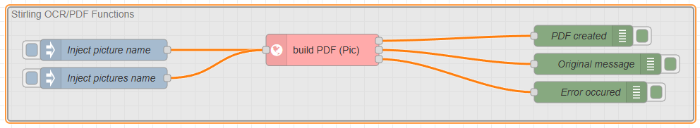

# Samples

To use the samples, you have to setup some basic information on the flow page before..

- SourceFileName    : set the filename that should be "injected" here. The location must exist.
- TestPictureName   : is used to convert a picture into a PDF document.
- TestPictureNames  : is used to convert several pictures into a PDF document, each picture on a page.

## Lock / Unlock file sample

This tests are in the example folder of this project.

You can inject the file and test the lock, increment and decrement also as the unlock functions.

## Set properties sample

This tests are in the example folder of this project.

Test the setting of properties

## Stirling sample

This tests are in the example folder of this project.

You can test the Stirling Service calls

  