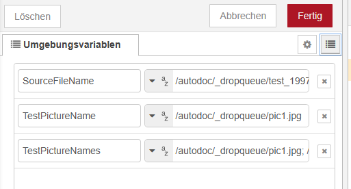
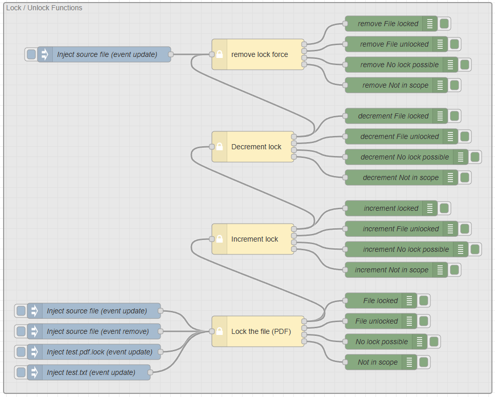
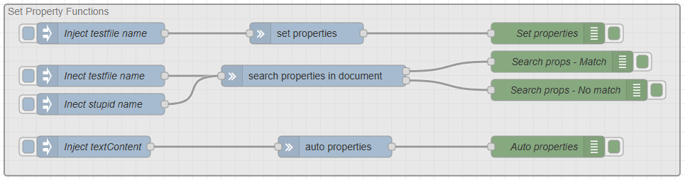

# Test Cases
Before using the testcases, you have to setup some flow vars to be able to address the input area and the Stirling Service.

|Varname|Used for
|:--|:--| 
`SourceFileName`|Specify an accessable file here, best a PDF file
`TestPictureName`|To test the conversion from a picture to a PDF, specify the source picture file here.
`TestPictureNames`|To test the conversion from several pictures to a single PDF, specify the source picture file names here.

## Lock / Unlock Tests

You can trigger the tests to lock, increment locks and unlock the sourcefile.

## Set Property Tests

With this tests, you can test the different property setting nodes.
1. Fixed properties,
2. Properties depending on the content
3. Auto Properties, using file infos and content.

## Sterling Service Tests

Test the Stirling functionialities with this tests. Be aware to configure your Stirling Service first in the build PDF node first.

This test converts one or more pictures into a PDF file.
